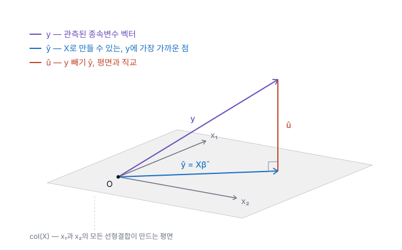
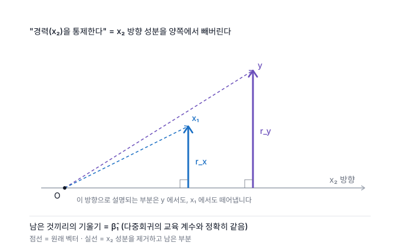

# 3장 · 다중회귀분석: 추정

*OLS는 사실 '수직으로 내리는 것'이다*


> [!NOTE]
> **교재 대응**
>
> **Wooldridge 7e 3장** — *Multiple Regression Analysis: Estimation*
> (2.2절 OLS 추정도 함께 다룹니다)
>
> - **표기**: Wooldridge 7판 기준 (SST / SSE / SSR — 아래 「표기 주의」 참조)
> - **필요한 선형대수**: 벡터, 선형결합, 내적, 직교 — 그 이상은 쓰지 않습니다


## 강의에서 보통 막히는 지점

강의는 대개 이렇게 진행됩니다. "잔차제곱합 $\sum \hat{u}_i^2$ 을 최소화하는 $\hat\beta$ 를 구하자. 미분해서 0으로 놓으면 정규방정식이 나오고, 풀면 이렇게 된다." 그리고 다음으로 넘어갑니다.

여기서 세 가지가 그냥 넘어갑니다.

1. **왜 하필 제곱합인가?** 보통 "부호를 없애려고"라고 답합니다. 그런데 절댓값을 써도 부호는 없어집니다. 진짜 이유는 다른 데 있습니다.
2. **"잔차가 설명변수와 직교한다"는 게 무슨 뜻인가?** 공식으로는 $\sum x_i \hat u_i = 0$ 이라고 나오는데, 이게 왜 중요한지는 안 알려줍니다.
3. **$R^2$ 는 왜 0과 1 사이인가?** $SST = SSE + SSR$ 이라는 분해가 어디선가 툭 튀어나옵니다. (표기가 교재마다 다릅니다 — 아래 「표기 주의」 참조)

이 세 개는 사실 **하나의 그림**으로 동시에 풀립니다. 이 절은 그 그림을 그립니다.

## 먼저, 공간을 바꿔야 합니다

이게 이 절에서 가장 중요한 부분입니다. 여기서 막히면 뒤가 전부 안 보이니 천천히 읽어주세요.

여러분이 아는 회귀 그림은 **산점도**입니다.

- 가로축 = 설명변수 $x$
- 세로축 = 종속변수 $y$
- 점이 $n$ 개
- 그 사이를 지나는 직선 하나

이걸 **변수공간(variable space)** 이라고 부릅니다. 축이 "변수"이기 때문입니다.

그런데 앞으로 볼 그림은 축을 완전히 다르게 잡습니다.

- **축 하나가 관측치 하나입니다.**
- 관측치가 3명이면 3차원 공간, $n$ 명이면 $n$ 차원 공간.
- 이 공간에서 $y$ 는 점이 $n$ 개 흩어진 게 아니라, **화살표 하나**입니다. 첫 번째 사람의 임금이 첫 번째 좌표, 두 번째 사람의 임금이 두 번째 좌표, … 이렇게요.
- 마찬가지로 교육연수 $x_1$ 도 화살표 하나, 경력 $x_2$ 도 화살표 하나입니다.

이걸 **관측치공간(observation space)** 이라고 합니다. 데이터 한 **열**이 화살표 하나가 되는 겁니다.

> [!TIP]
> **한 문장 요약**
>
> 산점도에서는 **한 사람이 점 하나**였습니다. 지금부터는 **한 변수가 화살표 하나**입니다.


익숙하지 않은 게 당연합니다. 하지만 이 공간에서 보면 최소제곱법이 무엇을 하고 있는지가 그냥 눈에 보입니다.

## 그림

설명변수가 2개인 경우입니다. 관측치를 3개로 잡으면 3차원이라 종이에 그릴 수 있습니다.



읽는 법:

- **$x_1$, $x_2$** (회색) — 두 설명변수 벡터입니다. 이 둘을 섞어서(선형결합해서) 만들 수 있는 모든 점이 **회색 평면**입니다. 이 평면을 $\text{col}(X)$, "X의 열공간"이라고 부릅니다.
- **$y$** (보라색) — 실제 관측된 종속변수입니다. **평면 밖에 있습니다.** 이게 핵심입니다.
- **$\hat{y}$** (파란색) — 평면 위에서 $y$ 에 가장 가까운 점입니다.
- **$\hat{u}$** (빨간색) — $y - \hat{y}$, 즉 잔차입니다. **평면과 정확히 직각**을 이룹니다.

## 이제 세 가지 질문이 풀립니다

### 우리는 도대체 무엇을 추정하는가

$x_1$ 과 $x_2$ 를 아무리 섞어도 만들 수 있는 건 **평면 위의 점들뿐**입니다. 그런데 $y$ 는 평면 밖에 있습니다. 완벽하게 맞출 방법이 없습니다.

그러면 최선은 뭘까요? **평면 위에서 $y$ 에 가장 가까운 점을 고르는 것**입니다. 그게 $\hat{y}$ 입니다.

$$\hat{y} = \hat\beta_1 x_1 + \hat\beta_2 x_2$$

여기서 계수 $\hat\beta$ 는 그 자체가 목표가 아니라, **$\hat{y}$ 라는 점에 도달하기 위한 배합 비율**입니다. "교육연수를 얼마만큼, 경력을 얼마만큼 섞으면 저 점이 나오는가." 이 관점은 나중에 다중공선성을 이해할 때 결정적입니다.

### 왜 제곱합인가

"가장 가까운 점을 고른다"에서 **가깝다 = 거리가 짧다**입니다. 그리고 벡터 사이의 거리는 각 좌표 차이의 제곱을 더한 뒤 제곱근을 씌운 것이죠 — 피타고라스 정리입니다.

$$\text{거리}(y, \hat{y}) = \sqrt{\sum_{i=1}^{n} (y_i - \hat y_i)^2} = \sqrt{\sum \hat u_i^2}$$

제곱근은 단조증가 함수니까, 이 거리를 최소화하는 것과 **잔차제곱합을 최소화하는 것은 완전히 같은 문제**입니다.

그러니까 제곱합은 "부호를 없애려고" 쓰는 게 아니라, **거리를 재는 자연스러운 방법이 제곱합이기 때문**입니다. 절댓값을 쓰면 다른 종류의 거리(맨해튼 거리)를 최소화하게 되고, 그건 실제로 다른 추정량(최소절대편차, LAD)이 됩니다. 틀린 게 아니라 다른 겁니다.

### 직교가 왜 나오는가

평면 위의 한 점에서 평면 밖의 점까지 **가장 짧은 경로는 수직으로 내려온 선**입니다. 비스듬하게 가면 반드시 더 깁니다.

그래서 최적점 $\hat{y}$ 에서는 자동으로 $\hat{u} \perp \text{평면}$ 이 됩니다. 평면은 $x_1, x_2$ 가 만든 것이니, 잔차는 **모든 설명변수와 직교**합니다.

$$x_1' \hat u = 0, \qquad x_2' \hat u = 0 \qquad \Longleftrightarrow \qquad X'\hat u = 0$$

이게 교재의 **정규방정식**입니다. 미분해서 나온 1계조건과 완전히 같은 식인데, 그림에서는 "수직으로 내렸으니까"라는 한 마디로 끝납니다.

> [!IMPORTANT]
> **자주 헷갈리는 지점**
>
> $X'\hat u = 0$ 은 **표본에서 항상 성립하는 산술적 사실**입니다. OLS로 계산했다면 자동으로 참입니다. 이건 가정 MLR.4 ($E(u|x) = 0$) 와 **다른 이야기**입니다. MLR.4는 모집단에 대한 가정이고, 검증할 수 없으며, 틀릴 수 있습니다. 잔차가 직교한다고 해서 모형이 옳다는 증거가 되지 않습니다.
>
> 이 둘을 섞어서 "잔차랑 x가 상관없으니까 내생성 문제는 없네요"라고 말하는 실수가 대단히 흔합니다.


### 잠깐 — 표기부터 정리하고 갑시다

> [!WARNING]
> [!WARNING]
> **SSE와 SSR은 교재마다 정반대입니다**

이 노트는 **Wooldridge 7판의 표기**를 따릅니다.

| 무엇의 제곱합인가 | Wooldridge 7e<br/>(이 노트) | Stock &amp; Watson | 통계학 교재<br/>(ANOVA 계열) | 통계 패키지<br/>(SAS·Stata 계열) |
|---|---|---|---|---|
| 총변동 $\sum(y_i-\bar y)^2$ | **SST** | TSS | SST | SST (Total) |
| 설명된 변동 $\sum(\hat y_i-\bar y)^2$ | **SSE**<br/>*Explained* | ESS | **SSR**<br/>*Regression* | **SSM**<br/>*Model* |
| 잔차 변동 $\sum \hat u_i^2$ | **SSR**<br/>*Residuals* | SSR | **SSE**<br/>*Error* | **SSE**<br/>*Error* |

같은 세 글자가 **네 가지 뜻**으로 돌아다닙니다.

- **SSE** — Wooldridge에서는 *Explained*(설명된), 나머지 대부분에서는 *Error*(잔차).
  **정확히 반대**입니다.
- **SSR** — Wooldridge에서는 *Residuals*(잔차), ANOVA 계열에서는 *Regression*(설명된).
  이것도 **반대**입니다.
- **SSM** — *Model*. 설명된 변동을 가리키며, SSE(Error)와 짝으로 쓰입니다.
  약자가 겹치지 않아서 오해가 적은 편입니다.

그래서 규칙은 하나입니다.

> **약자를 외우지 마세요. 매번 "무엇의 제곱합인가"를 확인하세요.**

그리고 **시험과 과제에서는 반드시 수업에서 지정한 교재의 표기를 쓰십시오.**
이 노트의 표기가 아니라요.

소프트웨어는 이 혼동을 아예 피해 갑니다. Stata의 `regress` 출력은
`Model` / `Residual` / `Total` 이라고 **단어로** 적고, R의 `anova()` 도 행 이름으로
구분합니다. 애매한 약자를 쓰지 않는 것입니다.

### $R^2$ 가 0과 1 사이인 이유

$\hat u$ 가 평면과 직각이므로, $y$, $\hat y$, $\hat u$ 는 **직각삼각형**을 이룹니다. 피타고라스 정리를 쓰면 (모든 변수를 평균 차감했다고 하면):

$$\underbrace{\|y\|^2}_{SST\ (총변동)} = \underbrace{\|\hat y\|^2}_{SSE\ (설명된\ 변동)} + \underbrace{\|\hat u\|^2}_{SSR\ (잔차\ 변동)}$$

교재가 유도 없이 던져주는 그 분해입니다. 그림에서는 직각삼각형 하나일 뿐입니다.

기호에 의존하지 않고 쓰면 이렇게 됩니다 — **$y$ 의 총 변동은, $x$ 들로 설명되는 부분과
설명되지 않고 남은 부분으로 정확히 갈라진다.** 직각이기 때문에 갈라집니다. 직각이 아니면
교차항이 남아서 이 분해가 성립하지 않습니다.

그리고 $R^2 = SSE/SST$ 는 직각삼각형에서 밑변 제곱을 빗변 제곱으로 나눈 것, 즉

$$R^2 = \cos^2\theta$$

$\theta$ 는 $y$ 와 $\hat y$ 사이의 각도입니다. **$\cos^2$ 이니까 당연히 0과 1 사이**입니다. 증명이 필요 없습니다.

- $\theta = 0$: $y$ 가 평면 위에 있음 → 완벽한 적합 → $R^2 = 1$
- $\theta = 90°$: $y$ 가 평면과 수직 → $x$ 들이 아무 설명도 못 함 → $R^2 = 0$

## 이 그림으로 바로 설명되는 것들

이 절을 이해하면 뒤의 여러 주제가 거저 풀립니다.

### 변수를 추가하면 $R^2$ 가 절대 줄지 않는 이유

설명변수를 하나 더 넣으면 평면이 **3차원 공간으로 넓어집니다**. 넓어진 공간에서 고른 최선은, 좁았을 때의 최선보다 나쁠 수가 없습니다. 원래 평면도 그 안에 포함되어 있기 때문입니다.

그래서 잔차는 짧아지기만 하고, $R^2$ 는 커지기만 합니다.
**아무 의미 없는 난수를 넣어도 마찬가지입니다** — 난수가 만드는 방향으로도
평면이 아주 조금은 넓어지기 때문입니다. 그래서 $R^2$ 는 "설명을 잘한다"의 증거가
될 수 없습니다. **조정 $R^2$ 가 필요한 이유**가 이것입니다. (Wooldridge 6.3절)


### 다중공선성이 계수만 망가뜨리는 이유

$x_1$ 과 $x_2$ 가 거의 같은 방향을 가리킨다고 해봅시다. 두 화살표가 거의 겹치는 상황입니다.

- **평면 자체는 멀쩡합니다.** 여전히 평면이고, $\hat y$ 도 문제없이 잘 찾습니다. → **예측은 괜찮습니다.**
- 그런데 그 $\hat y$ 에 도달하는 **배합 비율이 불안정**해집니다. 거의 같은 방향의 두 화살표로 특정 점을 만들려면, "$`x_1`$ 을 크게 플러스, $`x_2`$ 를 크게 마이너스" 같은 조합이 무수히 많이 나옵니다. 데이터가 조금만 흔들려도 비율이 확 바뀝니다.

그래서 **계수의 표준오차만 커지고, 편향은 생기지 않으며, 적합도는 멀쩡**합니다. VIF 공식을 외우는 것보다 이 그림 하나가 낫습니다. (Wooldridge 3.4절)

### "다른 조건이 같다면"의 정확한 의미 (FWL)

$\hat\beta_1$ 을 구하는 또 다른 방법이 있습니다.

1. $y$ 를 $x_2$ 에 회귀시키고 잔차를 남긴다 → $x_2$ 로 설명되는 부분을 **제거한** $y$
2. $x_1$ 을 $x_2$ 에 회귀시키고 잔차를 남긴다 → $x_2$ 로 설명되는 부분을 **제거한** $x_1$
3. 1번 잔차를 2번 잔차에 회귀시킨다

이렇게 나온 계수가 **다중회귀의 $\hat\beta_1$ 과 정확히 같습니다.** 이것이
Frisch–Waugh–Lovell 정리입니다.

그림으로 보면 이렇습니다. $x_2$ 방향을 가로축으로 눕혀놓고 보는 겁니다.



$y$ 도 $x_1$ 도 $x_2$ 방향 성분을 가지고 있습니다. 그 성분을 양쪽에서 똑같이
떼어내면, **$x_2$ 와 아무 상관 없는 부분만** 남습니다 (그림의 실선 $r_y$, $r_x$).
그 남은 것들 사이의 기울기가 바로 $\hat\beta_1$ 입니다.

**"다른 조건들이 동일할 때"** 라는 말의 정체가 바로 이것입니다.
통제한다 = 그 변수 방향의 성분을 빼버린다 = **직교하는 부분만 남긴다**.
이 그림 없이는 "통제"가 그냥 주문 같은 말로 남습니다.
(Wooldridge 3.2절 "부분효과" 논의)

그래서 $\hat\beta_1$ 은 이렇게 읽습니다.

> **경력($x_2$)이 동일할 때**, 교육($x_1$)이 1년 많으면 임금이 평균 $\hat\beta_1$ 만큼 높다.

> [!IMPORTANT]
> **"다른 조건"은 넣은 변수까지만입니다**
>
> 위 그림에서 제거한 것은 $x_2$ 방향뿐입니다. **모형에 넣지 않은 변수의 방향은
> 하나도 제거되지 않았습니다.**
>
> 그러니 "다른 **모든** 조건이 동일할 때"라고 쓰면 틀립니다. 능력을 넣지
> 않았다면 능력은 여전히 $\hat u$ 안에 살아 있습니다.
>
> 계수를 해석할 때는 **무엇을 고정했는지 이름을 대세요.** "경력이 동일할 때"처럼
> 구체적으로 쓰면, 무엇이 통제되지 않았는지도 자연히 드러납니다.

## 코드로 확인하기

> [!NOTE]
> **정리 중입니다**
>
> 아래 코드는 초안이고, 실행 결과는 아직 문서에 포함되어 있지 않습니다.
> 스크립트는 추후 별도로 정리할 예정입니다. 본문을 읽는 데는 필요하지 않으니
> 건너뛰어도 됩니다.

"그림이 그렇다더라"로 끝내지 말고 직접 확인해봅시다. 화면에 0이 찍히는 걸 보는 게 중요합니다.


### R

```r
library(wooldridge)
data(wage1)

m <- lm(lwage ~ educ + exper, data = wage1)
X  <- model.matrix(m)     # 상수항 포함 설계행렬
u  <- resid(m)            # 잔차 벡터
yh <- fitted(m)           # ŷ
y  <- wage1$lwage
```

**(1) 잔차는 모든 설명변수와 직교하는가?**

```r
round(t(X) %*% u, 10)
```

전부 0입니다. 상수항과도 직교한다는 건 **잔차의 합이 0**이라는 뜻입니다.

**(2) 피타고라스 정리가 성립하는가?**

```r
SST <- sum((y  - mean(y))^2)   # 총변동
SSE <- sum((yh - mean(y))^2)   # 설명된 변동 (Wooldridge 표기!)
SSR <- sum(u^2)                # 잔차 변동  (Wooldridge 표기!)

c(SST = SST, SSE_plus_SSR = SSE + SSR)
```

**(3) $R^2$ 는 정말 $\cos^2\theta$ 인가?**

```r
yc  <- y  - mean(y)
yhc <- yh - mean(y)
cos_theta <- sum(yc * yhc) / (sqrt(sum(yc^2)) * sqrt(sum(yhc^2)))

c(cos2 = cos_theta^2, R2 = summary(m)$r.squared)
```

각도로 환산하면:

```r
acos(cos_theta) * 180 / pi   # 도 단위
```

### Stata

데이터는 [JustinMShea/wooldridge](https://github.com/JustinMShea/wooldridge) 저장소의 `stata/` 폴더 또는 교재 웹사이트에서 받을 수 있습니다.

```stata
use wage1.dta, clear

regress lwage educ exper
predict double yhat, xb      // double 필수: 기본 float 는 정밀도가 모자라
predict double uhat, resid   //   직교성이 0 으로 안 찍힙니다
```

**(1) 잔차는 모든 설명변수와 직교하는가?**

```stata
* 각 설명변수와의 내적, 그리고 잔차의 합(= 상수항과의 내적)
generate double prod_educ  = educ  * uhat
generate double prod_exper = exper * uhat

quietly total uhat prod_educ prod_exper
matrix D = e(b)

display "상수항 : " %14.6e D[1,1]
display "educ   : " %14.6e D[1,2]
display "exper  : " %14.6e D[1,3]
```

세 값 모두 0입니다 — 정확히는 $10^{-10}$ 수준으로, 다루는 숫자의 크기에 비하면
0입니다. 상수항과의 직교가 곧 **잔차의 합이 0**이라는 뜻입니다.

**(2) 피타고라스 정리가 성립하는가?**

```stata
quietly summarize lwage
scalar ybar = r(mean)

generate double dy  = (lwage - ybar)^2
generate double dyh = (yhat  - ybar)^2
generate double du  = uhat^2

quietly total dy dyh du
matrix T = e(b)

scalar SST = T[1,1]     // 총변동
scalar SSE = T[1,2]     // 설명된 변동 (Wooldridge 표기)
scalar SSR = T[1,3]     // 잔차 변동  (Wooldridge 표기)

display "SST       = " SST
display "SSE + SSR = " SSE + SSR
```

**(3) $R^2$ 는 정말 $\cos^2\theta$ 인가?**

```stata
quietly regress lwage educ exper
scalar R2 = e(r2)

correlate lwage yhat
scalar cos_theta = r(rho)      // 평균 차감 후 상관계수 = cos θ

display "cos^2 = " cos_theta^2
display "R2    = " R2
display "각도  = " acos(cos_theta) * 180 / _pi " 도"
```


> [!NOTE]
> **R과 Stata를 나란히 두는 이유**
>
> 같은 식을 두 언어로 쓰면 "어떤 명령을 치느냐"와 "무엇을 계산하느냐"가 분리됩니다. `lm`과 `regress`는 이름만 다를 뿐 똑같은 $X'X$ 를 풀고 있다는 걸 보면, 소프트웨어가 아니라 방법을 배우게 됩니다.
>
> Stata에서 `correlate lwage yhat`이 곧 $\cos\theta$ 라는 점에 주목하세요. **상관계수는 원래 각도의 코사인**입니다. 이것도 이 그림에서 나오는 이야기입니다.


**(4) FWL이 정말 성립하는가?**

```r
r_y <- resid(lm(lwage ~ exper, wage1))   # exper 성분 제거한 lwage
r_x <- resid(lm(educ  ~ exper, wage1))   # exper 성분 제거한 educ
coef(lm(r_y ~ r_x))[2]
coef(lm(lwage ~ educ + exper, wage1))["educ"]
```

```stata
quietly regress lwage exper
predict double ry, resid
quietly regress educ exper
predict double rx, resid

regress ry rx
regress lwage educ exper
```

**(5) 변수를 추가하면 $R^2$ 가 정말 안 줄어드는가?**

```r
set.seed(42)
wage1$junk <- rnorm(nrow(wage1))
summary(lm(lwage ~ educ, wage1))$r.squared
summary(lm(lwage ~ educ + exper, wage1))$r.squared
summary(lm(lwage ~ educ + exper + junk, wage1))$r.squared
```

## 흔한 오해

| ✗ 오해 | ✓ 사실 |
|---|---|
| 잔차와 $x$ 의 상관이 0이니 내생성 문제가 없다 | $X'\hat u = 0$ 은 OLS의 산술적 결과라 **항상** 성립합니다. 모형의 타당성과 무관합니다 |
| 다중공선성이 있으면 OLS가 편향된다 | 불편성은 그대로입니다. **분산만** 커집니다 |
| $R^2$ 가 높으면 좋은 모형이다 | $R^2$ 는 $y$ 와 $\hat y$ 의 각도일 뿐, 인과관계와 아무 상관이 없습니다 |
| 제곱합을 쓰는 건 부호를 없애기 위해서다 | 거리를 재기 위해서입니다. 절댓값도 부호를 없애지만 다른 추정량이 됩니다 |
| 설명변수를 많이 넣을수록 설명력이 좋아진다 | $R^2$ 는 기계적으로 올라갑니다. 난수를 넣어도 올라갑니다 |
| 다중회귀를 돌렸으니 다른 조건은 다 통제됐다 | **모형에 넣은 변수의 방향만** 제거됩니다. 안 넣은 것은 그대로 남아 있습니다 |
| 계수 해석에 "다른 조건이 동일할 때"는 생략해도 된다 | 회귀계수는 언제나 조건부 해석입니다. 빼면 틀린 문장이 됩니다 |
| SSE는 어느 교재에서나 잔차제곱합이다 | Wooldridge에서 SSE는 **설명된** 제곱합입니다. 통계학 교재와 정반대입니다 (아래 「표기 주의」) |

## 연습문제

1. `wage1` 에서 `lwage` 를 `educ`, `exper`, `tenure` 에 회귀시키고, 잔차가 세 변수 **모두**와 직교함을 R과 Stata 양쪽에서 확인하세요.
2. 위 회귀에서 $y$ 와 $\hat y$ 사이의 각도를 도(degree) 단위로 구하세요. $R^2$ 와 어떻게 연결되는지 설명하세요.
3. `educ` 와 거의 같은 변수를 인위적으로 만들어 (`educ2 = educ + 0.01 * rnorm(n)`) 회귀에 함께 넣어보세요. ① 계수와 표준오차, ② $R^2$, ③ 예측값 $\hat y$ 가 각각 어떻게 변하는지 확인하고, @sec-payoffs 의 설명과 맞는지 판단하세요.
4. FWL을 `tenure` 에 대해 직접 수행해서 다중회귀 계수와 일치함을 보이세요.

---

> [!TIP]
> **다음 절**
>
> 이 그림을 그대로 들고 가면 **8장 이분산**과 **14장 고정효과**가 훨씬 쉬워집니다. 고정효과의 "집단 내 변환(within transformation)"은 사실 개체 더미가 만드는 공간으로 사영하고 남은 잔차를 쓰는 것 — 즉 **더미에 대한 FWL** 입니다.
